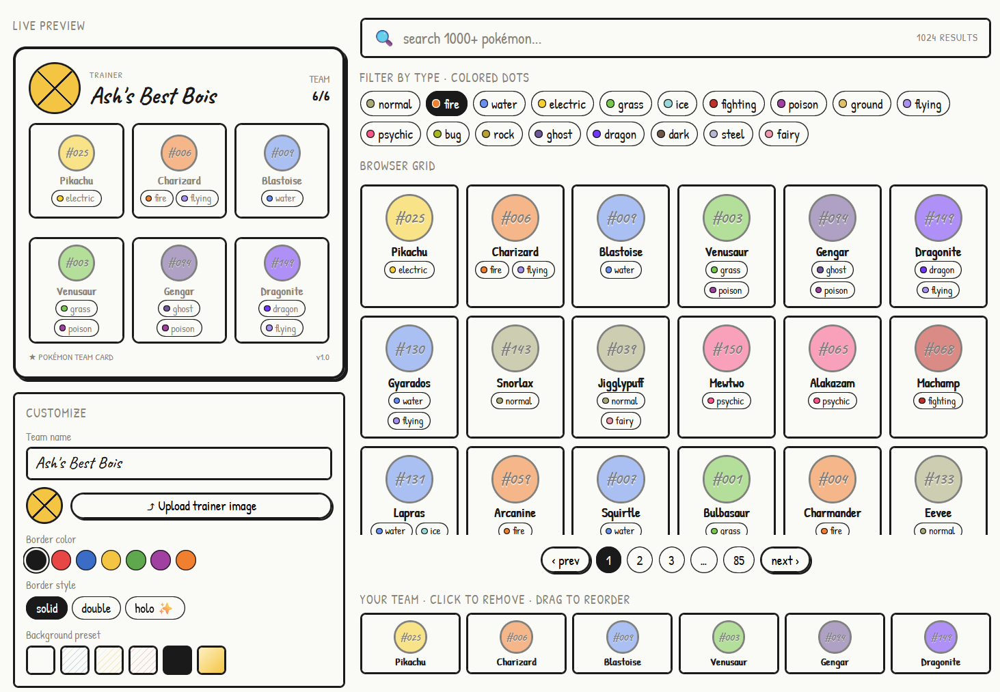
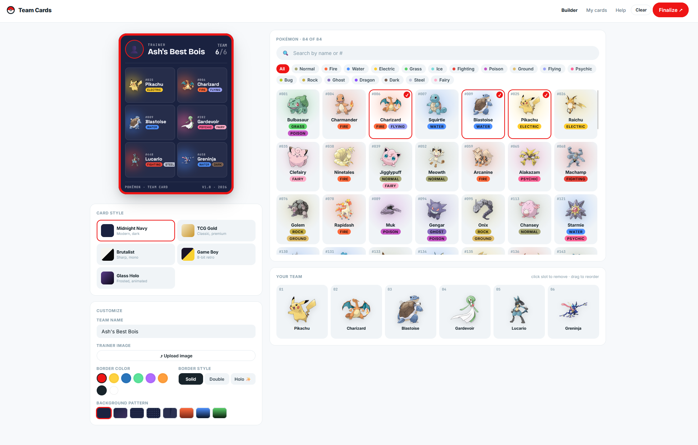

# Trainer Cards · Pokémon Team Card Builder

Build a 6-Pokémon trainer card, theme it five different ways, and export it as a PNG. Every customization renders live on the card.

## Project link

- **Live demo**: https://trainer-cards.vercel.app/
- **Repo**: https://github.com/BagelSamurai/Trainer-Cards

> Run locally: `npm install && npm run dev` then open [http://localhost:3000](http://localhost:3000).

## Development approach

This project was built in two phases. In the first phase I laid out the groundwork myself: the Next.js app structure, the data types, the PokéAPI fetching strategy, a working stub of each component, and the overall layout concept. Once the foundation was solid I used it as a testbed to explore how AI (specifically Claude) could push the product further — refining the component architecture, introducing the five-theme system, wiring up the Context-based state sharing, and delivering the PNG export pipeline.

The wireframes that guided the UI were designed in **Claude Design** before a line of code was written:

And the finished product:

## About

A web app that lets a Pokémon fan compose a 6-member team and design a "trainer card" they can share. Pick a theme, swap border colors and patterns, drop your trainer photo in, search across the full Pokédex, drag your team into the order you want, then jump to the Finalize screen and either download the card as a PNG or copy it straight to your clipboard.

Highlights:

- **Five card themes** — Midnight Navy, TCG Gold, Brutalist, Game Boy (with animated scanlines), and Glass Holo (with a slow shine sweep). Each theme swaps the card's font family, palette, frame treatment, and footer style independently of the user's border/background overrides.
- **Full Pokédex** — all ~1025 Pokémon, fetched once and cached. Search by name or dex number, filter by any of the 18 types.
- **Drag-to-reorder team** — the 6 slot row uses `@dnd-kit` so reordering feels native and is keyboard-accessible.
- **Real PNG export** — the card on `/finalize` is rasterized at 2× pixel ratio with `html-to-image`, so the downloaded file is crisp and matches what's on screen.
- **Viewport-locked builder** — card preview, customize panel, Pokédex browser, and the team row are all visible at once; only the Pokédex grid scrolls.

## Tech stack

| Layer            | Choice                                                                 | Why                                                                                          |
| ---------------- | ---------------------------------------------------------------------- | -------------------------------------------------------------------------------------------- |
| Framework        | **Next.js 16** (App Router) on **React 19**                            | Server-rendered shell, route-level code-splitting, simple API route for the Pokémon fetch.   |
| Styling          | **Tailwind CSS v4** with `@theme inline` design tokens                 | One source of truth for colors, fonts, radii. Tokens are CSS variables, so themes can mix.   |
| State            | **React Context** (`TeamProvider`)                                     | Team and card config need to flow from `/` to `/finalize`. Context is the lightest answer.   |
| Drag & drop      | **@dnd-kit/core** + **@dnd-kit/sortable**                              | Touch + keyboard accessible out of the box; minimal API for a 6-slot row.                    |
| Image export     | **html-to-image**                                                      | Tiny, modern, no Canvas dance. Both `toPng` and `toBlob` for download + clipboard paths.     |
| Fonts            | **next/font/google** for Inter, Bricolage Grotesque, JetBrains Mono, Space Grotesk, DM Serif Display, VT323 | Self-hosted, zero layout shift, scoped via CSS variables — themes pick whichever they want. |
| Data             | **PokéAPI** (REST), pull-once with `cache: "force-cache"`              | Free, no key, mirrors the canonical Pokémon data.                                            |
| Sprites          | `raw.githubusercontent.com/PokeAPI/sprites/...`                        | Predictable URL pattern keyed by id — no per-Pokémon fetch needed for images.                |
| Language         | **TypeScript** (strict)                                                | Pokémon shape, theme keys, border styles all union-typed; refactors stay safe.               |

## React hooks & patterns

| Hook / Pattern | Where | Why |
| --- | --- | --- |
| `useContext` | Every component that needs team or card state | Avoids prop-drilling `team`, `cardConfig`, and mutation functions through every layer. Both `/` and `/finalize` call `useTeam()` directly instead of receiving props. |
| `useCallback` | `toggleTeam`, `removeFromTeam`, `reorderTeam`, `clearTeam` in `TeamProvider` | `PokemonBadge` is memoised and receives `onToggle` as a prop. Without `useCallback`, `onToggle` gets a new function reference on every render, defeating `memo` and forcing all ~1025 cells to re-render on every keypress. Empty `[]` deps means the function is created once. |
| `useMemo` | Context value object in `TeamProvider`; filtered Pokémon list in `PokemonList` | (1) The context value is an object literal — without `useMemo` a new object is created every render, causing every `useTeam()` consumer to re-render even if nothing changed. (2) Filtering 1025 Pokémon on every render is expensive; `useMemo` re-runs it only when `pokemon`, `search`, or `activeType` actually change. |
| `useState` | Search term, active type filter, visible count in `PokemonList`; download/copy button states in `Finalize`; hover state in team slots | Local, ephemeral UI state that doesn't need to survive navigation or be shared. |
| `forwardRef` | `TrainerCard` | `html-to-image` needs the raw DOM node to rasterize the card to PNG. `forwardRef` lets the `Finalize` page pass a `ref` into `TrainerCard` and call `toPng(cardRef.current)` on it. |
| `useRef` | Card ref in `Finalize`; hidden file input in `Customize` | (1) `cardRef` holds the DOM node for export without triggering a re-render when assigned. (2) The trainer-image file input is hidden; `fileInputRef.current.click()` triggers it programmatically from the styled upload button. |

## Problems faced and things learnt

- **Loading 1025 Pokémon without melting PokéAPI.**
  The naïve approach (1 list call + 1025 detail calls) rate-limits and times out. Workaround: fetch the list once, fetch each of the 18 type endpoints in parallel, and build a `name → types[]` map locally. **19 fetches total** instead of 1025. Sprite URLs are synthesized from the id, so we don't need detail calls at all. Big lesson: when a public API gives you "here are all rows of type X" endpoints, **invert the loop** rather than fan out per row.
- **Five themes from one component without a `if (theme === ...)` swamp.**
  First instinct was a giant switch in `TrainerCard`. Final answer: a `THEMES` registry where each entry is just data — `cardBg`, `ink`, `bodyFont`, `radius`, plus FX flags like `scanlines` and `glassShine`. The card component reads one entry and renders. Adding a sixth theme is a five-line object now.
- **State across two routes without reaching for Redux.**
  The Builder needs the team and config; the Finalize page needs the same data to render and rasterize. Initial draft kept state in `page.tsx`, which got wiped on navigation. Lifting it into a `<TeamProvider>` mounted in the root `layout.tsx` made both routes share the same source of truth, no extra library.
- **PNG export at the right resolution.**
  `html-to-image` defaults to 1× device-pixel ratio, which made the exported PNG look fuzzy on retina screens. Setting `pixelRatio: 2` solved it; `cacheBust: true` made sure the just-uploaded trainer image actually shows up in the export instead of a cached placeholder.
- **Tailwind v4's new shape.**
  This stack uses `@import "tailwindcss"` and `@theme inline { … }` in `globals.css` — there's no `tailwind.config.js`. Once that clicked, dropping in CSS variable tokens was very clean: every value the spec called out (`#f7f9fb`, `#18242b`, `#ee1515`, …) became a real Tailwind color class.
- **Viewport-locking the builder so nothing scrolls except the list.**
  Took some care with `min-h-0` on the flex columns — without it, `overflow-y: auto` won't actually clip and the parent expands forever. Now the Pokémon list scrolls internally, and the team row stays pinned at the bottom of the right column.

## Future roadmap

- **Persist state.** Right now a hard refresh wipes the team. `localStorage` (or `URL`-encoded compressed state) would let a built card survive a reload and be share-linkable.
- **My cards page.** Save snapshots of finished cards and let the user revisit them — currently the nav link is a placeholder.
- **Multi-Pokémon search filters.** Combine type + generation + name + ability rather than just one type at a time.
- **Generations / regional dex filters.** "Show me only Kanto" / "Hoenn" / etc.
- **Trainer image cropper.** Drop a non-square photo and currently it gets `object-cover` cropped to a circle; a proper cropper UI would be friendlier.
- **Card sharing as URL.** Encode `cardConfig` + team ids into a query string so a card has a permanent URL.
- **OG image route.** A Next.js `opengraph-image` route that renders the card server-side for social previews when sharing the URL.
- **More themes.** "First Edition" foil, "Master Ball", trainer-class-themed cards (Champion / Elite Four).
- **Animations on Builder.** Subtle entry animation when a Pokémon flies into the next empty slot.
- **Mobile layout.** The current 480/1fr split is desktop-only; need a stacked mobile view with a collapsible browser.
- **Tests.** Unit tests for the type-coverage / team-uniqueness logic, plus a Playwright smoke test for "build a team → finalize → download".
